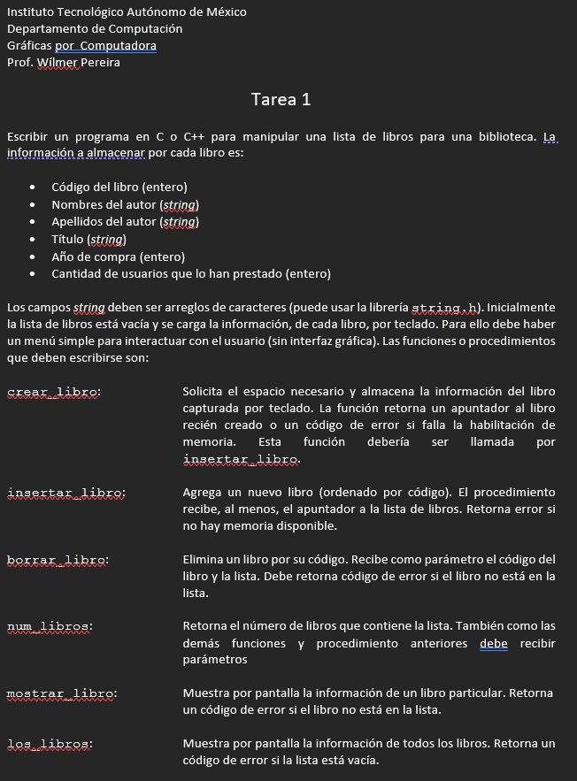

# LibraryManager

First Homework of Computer Graphics course

For correct use:

1. Download the repository
2. If you are using VS2019 or VS2022. Double click in your respective `.bat` file

> This wil create a `.sln` and other files that you need to run a VS project. Mean while premake will do a setup for custom directories for the different outputs of your VS  project.

If you want to know more about all the posibilities of premake just check [this](https://premake.github.io/docs/Using-Premake) documentation. Of course you need to create your own `.bat` file or run your commands in terminal.

## About the project

This homework is follow the following instructions:

